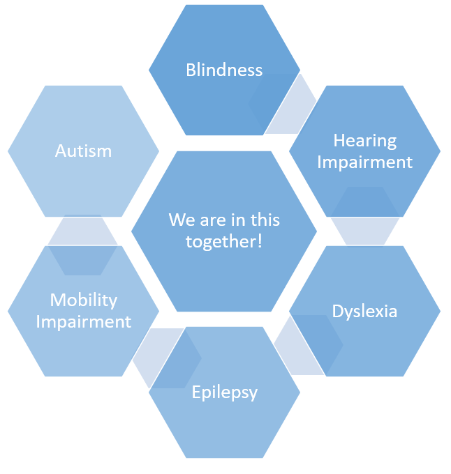

# InThisTogether

Assignment for 5rd semester course "Information Systems Implementation and Architecture"\
Department of Management Science and Technology\
Athens University of Economics and Business

### Our vision
We help those who are in need finding the perfect supporter for their everyday lives. We 've created a website where people with mental or physical disabilities and their relatives can search for a supporter who will help them with their day to day activities!

Our vision is to remind people that they don't have to fight alone. Everyone needs someone by their side! We are all InThisTogether!

### Are you a person with disabilities?

* Are you searching for a supporter to assist you in your everyday life?
Check out our qualified supporters profiles and choose the most suitable for your needs(type of disability, service, etc.). Feel free to contact them through email or phone number. Our qualified candidates support the following disabilities.

* Can't find a suitable match?
If you need a different kind of help, feel free to publish an ad and describe your requirements. Our available and suitable supporters will reach you as soon as possible! Don't forget, you need to create an account in order to publish an ad!

### Are you an AMEA supporter?

Are you searching for a job in your specialty?
Create an Account with all your basic information, type of education and experience. Once you do that, your profile will appear here and people in need of your services will reach you through your contact information(email, phone number).
Don't forget to constantly check on the ads. Might be someone out there looking for someone just like you!

## Authors
| Full Name | Github Account |
| --- | --- |
| Chalkiopoulou Vasiliki | [VasilikiChalkiopoulou](https://github.com/VasilikiChalkiopoulou) |
| Davari Athina | [AthinaDavari](https://github.com/AthinaDavari) |
| Shambel Anna | [AnnaShambel3](https://github.com/AnnaShambel3) |
| Tzerefou Elena | [ElenaTzerefou](https://github.com/ElenaTzerefou) |
